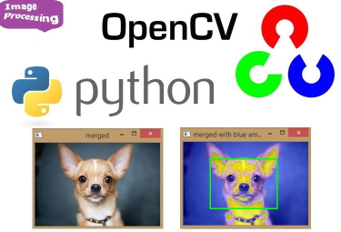

# EESEC 448
Merhaba arkadaşlar. Bu sayfada **OpenCV**'nin **OpenCV for Beginners** isimli resmi kursunu referans olacağız. Bu kursa 

https://opencv.org/course-opencv-for-beginners/

bağlantısından ulaşabilirsiniz. Kursa kayıt ücreti $117. Ben bu kursa  

https://www.kickstarter.com/projects/opencv/opencv-for-beginners

bağlantısından çok önce kayıt olup $57 ödemiştim. Ayrıca **Adrian Rosebrock** tarafından kurulan **PyImageSearch University** diğer büyük bir referansımız.

https://www.pyimagesearch.com/pyimagesearch-university/

Bu plana yaklaşık olarak $300 gibi bir ücretle kaydolabiliyorsunuz. Adrian'ın **PyImageSearch university** planında **OpenCV 101 — OpenCV Basics** kursunda öğretilen konuların hepsini EEM 448'de işleyeceğiz. Sizlerin bu kurs ve planlara kaydolmanız zorunlu değil. DBS ve bu sayfayı takip ederseniz yeterli olacaktır.

Bu sayfadaki projelerde **Python 3.9.6** ve **OpenCV 4.5.5** kullanacağız. Aşağıda açıklamalarını/sonuçlarını gördüğünüz projelerin **py** uzantılı **Python** kodlarını yukarıda **project** isimli dosyada bulabilirsiniz. Bilgisayarınıza **Python** yüklemek için aşağıdaki resime tıkladığınızda açılan videoyu takip edebilirsiniz. Bu videoda ayrıca **OpenCV** yüklemeye de başlıyoruz ama bir hata ile karşılaşınca yarıda kalıyor.

[](https://www.youtube.com/watch?v=HwQ46b3KmUw)

Karşılaşılan hatayı çözüp **OpenCV** yüklemeyi tamamladığımız video için aşağıdaki resme tıklayabilirsiniz.

[](https://www.youtube.com/watch?v=9DwK0K8UcAw)

## Proje 1: Resim Yükleme, Resmin Üzerine Yazı Yazma, Resmi Yeniden Boyutlandırma ve Dosyaya Kaydetme
Bu egzersizde OpenCV kütüphanesinden **imread()**, **putText()**, **resize()** ve **imwrite()** fonksiyonlarını kullanacağız. Resim yüklemek için kullandığımız fonksiyon olan **imread()** argüman olarak uzantısıyla beraber resim/fotoğraf ismi kabul ediyor. Yani fonksiyona *string* veri tipinde resmin uzantılı ismini giriş olarak veriyoruz. Mesela burada fotoğrafımızın ismi **IMG_20210616_202539.jpg** olduğundan **imread('IMG_20210616_202539.jpg')** şeklinde fonksiyonu çağırdığımızda resmi bizim ismini verdiğimiz değişkene atıyor. Bu arada gözden kaçırmayın, bütün fonksiyonları her zaman **cv2** anahtar kelimemizin sonuna **nokta** koyup çağırıyoruz, çünkü **cv2** yazdığımız kodda OpenCV kütüphanesini temsil ediyor. Zaten bu yüzden her kodumuzun başında **import cv2** diye bir komutla OpenCV'yi aktif hale getirmiş oluyoruz. Burada yazdıklarımızın kısa bir özeti: Eğer **IMG_20210616_202539.jpg** isimli bir resmi OpenCV'de Python ile okuyup **resim** isminde bir değişkene atamak istiyorsak, o zaman aşağıdaki kodu koşturmalıyız.

```
import cv2
resim = cv2.imread('IMG_20210616_202539.jpg')
```

Aşağıdaki kod resmin **yüksekliğini** (height), **genişliğini** (width) ve BGR (Blue-Green-Red yani Mavi-Yeşil-Kırmızı) kanal sayısını (channels) **print** komutuyla ekrana basıyor. Burada yükseklik satır sayısına, genişlik sütun sayısına eşit. Aşağıdaki kod satırında **resim.shape[0]** ve **resim.shape[1]** komutları sırasıyla resmin yükseklik ve genişliğini piksel cinsinden bir sayı olarak ekrana basıyor.

```
print('yükseklik = %i   genişlik = %i   kanal sayısı = %i' %(resim.shape[0], resim.shape[1], resim.shape[2]))
```

Aşağıdaki videoyu izleyerek yukarıda bir kısmı açıklanan ve tamamı aşağıda verilen kodu gerçekleyebilirsiniz.

[](https://youtu.be/622veo4_lDw)

```
import cv2 # OpenCV kütüphanesine erişim
resim = cv2.imread('IMG_20210616_202539.jpg') # resim yükle
print('yükseklik = %i   genişlik = %i   kanal sayısı = %i' %(resim.shape[0],resim.shape[1],resim.shape[2]))
# resmin üzerine yazı yazalım
font = cv2.FONT_HERSHEY_SIMPLEX # font tipi
org = (300, 300) # yazının içinde bulunduğu dikdörtgenin sol alt köşesi
fontScale = 7 # font büyüklüğü
color = (0, 0, 0) # BGR sırasında yazının renk kodu
thickness = 12 # yazının kalınlığı
yaziliResim = cv2.putText(resim, 'Gumushane', org, font, fontScale, color, thickness, cv2.LINE_AA)
# resmi yeniden boyutlandır, dosyaya kaydet ve ekranda görüntüle
s = 0.2 # scale - ölçek
dim = (int(s*resim.shape[1]), int(s*resim.shape[0])) # boyut
kucukResim = cv2.resize(yaziliResim, dim, interpolation = cv2.INTER_AREA)
cv2.imwrite('Gumushane.jpg', kucukResim, [cv2.IMWRITE_JPEG_QUALITY, 100])
cv2.imshow("Uzerine yazi yazilmis ve yeniden boyutlandirilmis resim", kucukResim)
cv2.waitKey(0) # klavyede herhangi bir tuşa basana kadar ekranda görüntüle
```


### Referanslar
[1] OpenCV 4.5.5 Dökümantasyonu - https://docs.opencv.org/4.5.5/</br>
[2] Standard Kütüphane ve **numpy** ile Rasgele Sayı, Dizi ve Matris Üretme - https://machinelearningmastery.com/how-to-generate-random-numbers-in-python/</br>
[3] OpenCV'de Eşikleme (Thresholding) [A. Rosebrock, pyimagesearch.com] - https://www.pyimagesearch.com/2021/04/28/opencv-thresholding-cv2-threshold/</br>
[4] OpenCV'de Görüntü Filtreleme (Bulandırma) [A. Rosebrock, pyimagesearch.com] - https://www.pyimagesearch.com/2021/04/28/opencv-smoothing-and-blurring/</br>
[5] OpenCV'de **Haar Cascade** Metodu ile Yüz Tespiti [A. Rosebrock, pyimagesearch.com] - https://www.pyimagesearch.com/2021/04/05/opencv-face-detection-with-haar-cascades/</br>
[6] Raspberry Pi ve OpenCV kullanarak Pan-Tilt Kamera ile Yüz Takibi [A. Rosebrock, pyimagesearch.com] - https://www.pyimagesearch.com/2019/04/01/pan-tilt-face-tracking-with-a-raspberry-pi-and-opencv/</br>
[7] Haar Cascade ile Yüz ve Göz Tespiti (OpenCV tutorial) - https://docs.opencv.org/4.x/db/d28/tutorial_cascade_classifier.html</br>
[8] OpenCV'de Renk Uzayları Arasında Dönüşüm - https://www.pyimagesearch.com/2021/04/28/opencv-color-spaces-cv2-cvtcolor/</br>
[9] OpenCV ile Yeşil Top Tespiti (Takibi) - https://www.pyimagesearch.com/2015/09/14/ball-tracking-with-opencv/</br>
[10] OpenCV'de **time** paketi kullanılarak FPS hesaplanması - https://www.geeksforgeeks.org/python-displaying-real-time-fps-at-which-webcam-video-file-is-processed-using-opencv/
